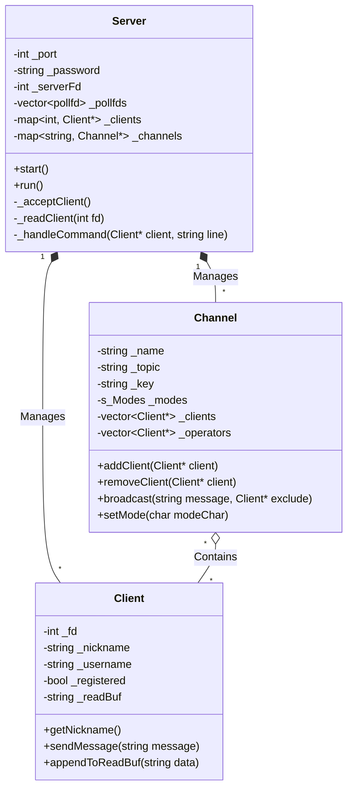
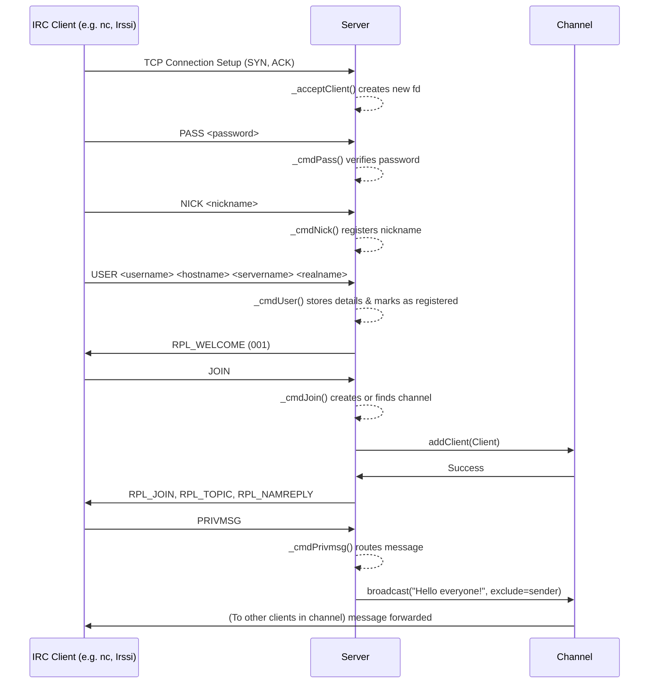

# ft_irc - Internet Relay Chat Server

`ft_irc` is a custom Implementation of an Internet Relay Chat (IRC) server in C++98. It allows multiple clients to connect, authenticate, join channels, and communicate in real-time. The server is built using non-blocking I/O and I/O multiplexing with `poll()`.

## 🏗️ Architecture & Class Structure

The project is structured around three main classes: `Server`, `Client`, and `Channel`.

- **Server**: Handles the main loop, accepting incoming connections, managing the `poll()` system call, reading data from client sockets, and routing IRC commands to their respective handler functions.
- **Client**: Represents a connected user. It stores user information (nickname, username, hostname, registration status) and manages the read-buffer for incoming data streams.
- **Channel**: Represents a chat room. It manages the list of connected clients, channel operators, modes (like invite-only, topic restrictions, user limits, and keys), and handles broadcasting messages to its members.

### Class Diagram



## 🔄 Execution Flow (Sequence Diagram)

The following diagram illustrates the typical flow of a client connecting to the server, authenticating, and sending a message to a channel.



## 📜 Supported IRC Commands

The server implements a substantial subset of the IRC protocol specifications (RFC 1459 / 2812):

*   **Connection & Auth:** `PASS`, `NICK`, `USER`, `QUIT`, `PING`
*   **Channel Operations:** `JOIN`, `PART`, `TOPIC`
*   **Messaging:** `PRIVMSG` (Supports both Channel and Direct Messaging)
*   **Channel Management:** `KICK`, `INVITE`, `MODE`

## ⚙️ Channel Modes Supported

The `MODE` command supports the following flags for channels:
*   `i`: Set/remove Invite-only channel.
*   `t`: Set/remove the restrictions of the TOPIC command to channel operators.
*   `k`: Set/remove the channel key (password).
*   `o`: Give/take channel operator privilege.
*   `l`: Set/remove the user limit to channel.

## 🚀 How to Build and Run

### Prerequisites
- Build tool: `make`
- Compiler: `c++` (clang++ or g++) with C++98 support.

### Compilation
Simply run the Makefile provided in the root directory:
```bash
make
```

### Execution
Run the server with a specified port and password:
```bash
./ircserv <port> <password>
```
*Example:* `./ircserv 6667 mypassword`

### Connecting
You can connect to the server using any standard IRC Client (like `Irssi`, `WeeChat`, or `netcat`/`nc` for raw testing).

*Using netcat:*
```bash
nc localhost 6667
PASS mypassword
NICK mynick
USER myuser 0 * :Real Name
```

